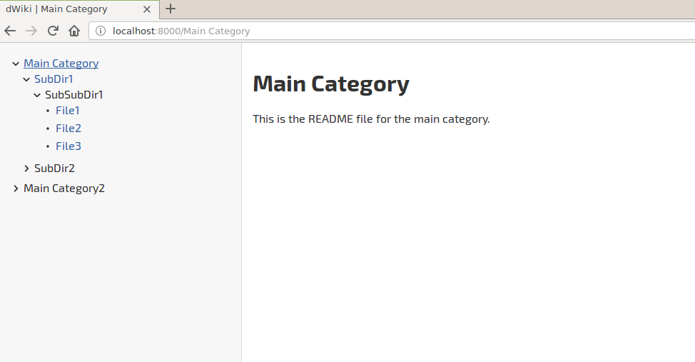

# dWiki - django Wiki

## Description
dWiki - django Wiki, a personal markdown wiki solution written in django.

## Setup
```
git clone https://github.com/Robin-Jonsson/dwiki.git
pip install django-markup
python manage.py runserver
```

### Dependencies
- django-markdown

## Usage
Add a media/dwiki folder and add your files there. README files will be the main file for the directory, without one there will be no "link" to the directory it self, but only to the files in it.
### Example
```
Main Category
    ├── README.md
    ├── SubDir1
    │   ├── README.md
    │   └── SubSubDir1
    │       ├── File1.md
    │       ├── File2.md
    │       └── File3.md
    └── SubDir2
Main Category2
...
```

## Screenshot


## Recommendations
- Change the SECRET_KEY in settings.py (in "production").
- Set DEBUG in settings.py to False (in "production").
- Make your media/dwiki directory a Git Repo (might be required in the future).

## Contributing
- Contributions are welcomed and will be considered.
- Changes to the CSS should be made in the SCSS file and then converted to CSS.
